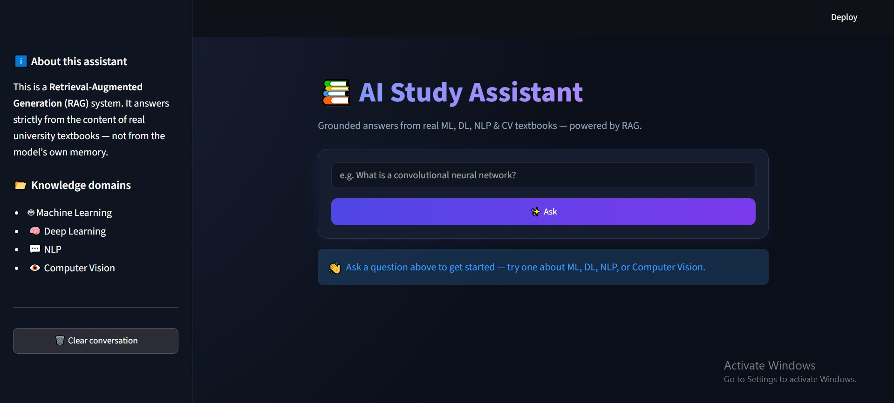
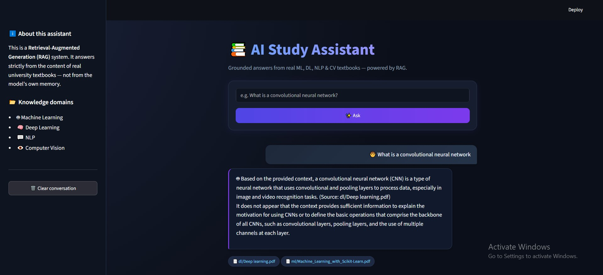
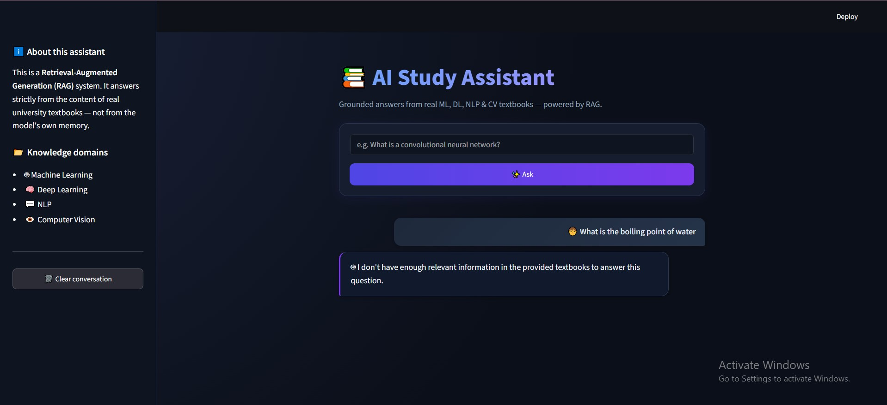
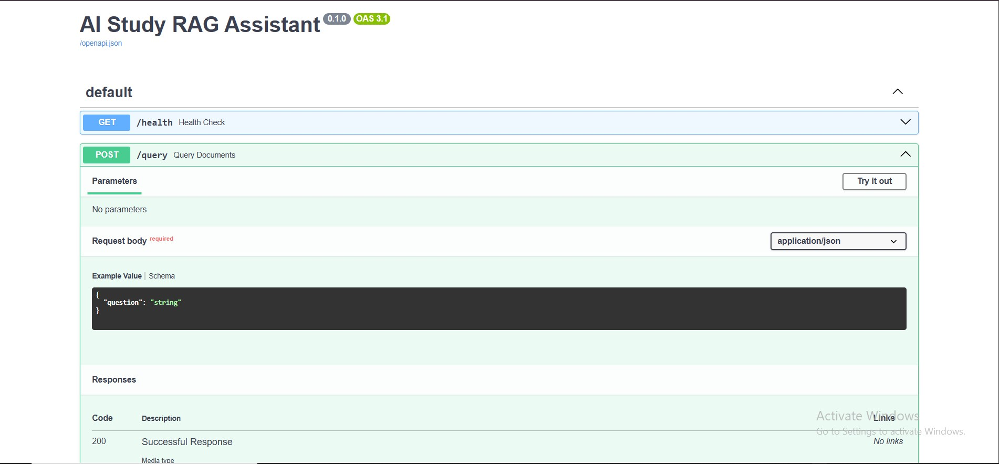
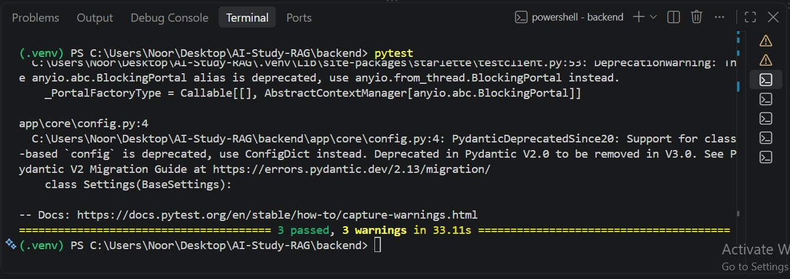

# AI Study Assistant — RAG-Powered Document Assistant

A Retrieval-Augmented Generation (RAG) web application that answers questions strictly from the content of real university textbooks across four domains: **Machine Learning, Deep Learning, NLP, and Computer Vision**. Built as part of the Level 2 Summer Training Graduation Project (Core Track).

---

## Overview

This project takes raw PDF textbooks, processes them into a searchable knowledge base, and serves grounded, cited answers through a chat-style web interface. Unlike a general-purpose chatbot, every answer is derived only from the retrieved textbook content — if the knowledge base doesn't contain relevant information, the system explicitly says so instead of guessing.

**Pipeline**: PDF textbooks → chunking → embeddings → vector store (ChromaDB) → retrieval → local LLM (Ollama) → grounded, cited answer.

---

## Architecture

```
┌─────────────┐      HTTP POST /query      ┌──────────────────┐
│  Frontend   │ ─────────────────────────▶ │     Backend       │
│ (Streamlit) │ ◀───────────────────────── │    (FastAPI)       │
└─────────────┘   { answer, sources }      └─────────┬─────────┘
                                                      │
                                     ┌────────────────┼────────────────┐
                                     ▼                                 ▼
                          ┌─────────────────────┐         ┌─────────────────────┐
                          │   ChromaDB           │         │   Ollama (local LLM) │
                          │  (vector store)       │         │   llama3.2:1b         │
                          │  5,514 text chunks     │         └─────────────────────┘
                          └─────────────────────┘
                                     ▲
                                     │  built once, offline
                          ┌─────────────────────┐
                          │  Jupyter Notebook     │
                          │  (chunking + embed.)  │
                          └─────────────────────┘
                                     ▲
                                     │
                          ┌─────────────────────┐
                          │  4 PDF Textbooks      │
                          │  (ML, DL, NLP, CV)    │
                          └─────────────────────┘
```

**Flow**: A question typed in the Streamlit UI is sent to the FastAPI backend, which embeds the query, retrieves the most relevant chunks from ChromaDB, builds a grounded prompt, and calls a local Ollama model to generate the final answer with cited sources.

---

## Tech Stack

| Layer | Technology |
|---|---|
| Notebook / Data pipeline | Python, Jupyter (Google Colab), `pypdf`, `pandas` |
| Embeddings | `sentence-transformers` (`all-MiniLM-L6-v2`, 384-dim) |
| Vector database | ChromaDB (persistent mode) |
| LLM | Ollama, running `llama3.2:1b` locally |
| Backend | FastAPI, Pydantic, Uvicorn |
| Frontend | Streamlit |
| Testing | Pytest, FastAPI `TestClient` |

---

## Project Structure

```
AI-Study-RAG/
├── notebooks/
│   └── RAG_pipeline_ITI.ipynb      # full data → RAG pipeline (Phases 2.1–2.7)
├── backend/
│   ├── app/
│   │   ├── main.py                 # FastAPI app, CORS, router
│   │   ├── api/routes/query.py     # GET /health, POST /query
│   │   ├── core/config.py          # settings loaded from .env
│   │   ├── schemas/query.py        # QueryRequest / QueryResponse
│   │   ├── services/
│   │   │   ├── retrieval.py        # loads vector store, retrieves chunks
│   │   │   └── generation.py       # builds prompt, calls Ollama, grounding guard
│   │   └── utils/logging_config.py
│   ├── data/vector_store/          # persisted ChromaDB (built by the notebook)
│   ├── tests/test_query.py         # pytest suite (3 tests)
│   ├── requirements.txt
│   ├── .env.example
│   └── Dockerfile
├── frontend/
│   ├── app.py                      # Streamlit chat interface
│   ├── api_client.py               # wrapper around the backend API
│   ├── .env                        # API_BASE_URL
│   └── requirements.txt
├── screenshots/                    # app screenshots (see below)
└── .gitignore
```

> **Note**: The raw PDF textbooks and the `vector_store/` folder are excluded from version control (see [Domain & Data](#domain--data) below for how to obtain/rebuild them).

---

## Domain & Data

The knowledge base covers four domains, each built from one full university-level textbook (PDF):

| Domain | Source | Pages |
|---|---|---|
| Machine Learning | *Hands-On Machine Learning with Scikit-Learn, Keras & TensorFlow* | 851 |
| Deep Learning | *Deep Learning* textbook | 1,151 |
| NLP | *Natural Language Processing* course textbook | 258 |
| Computer Vision | *Computer Vision* course textbook | 129 |

**Total**: 4 textbooks, 2,389 pages, split into 5,514 chunks (1,000 characters, 200-character overlap).

These PDFs are **not included in this repository** (large files / copyrighted course material). To reproduce the pipeline:
1. Obtain the four textbooks yourself (e.g. from your university's course material or a licensed copy).
2. Place them under `data/documents/<domain>/` (folders: `ml`, `dl`, `nlp`, `cv`).
3. Run `notebooks/RAG_pipeline_ITI.ipynb` top to bottom — it will regenerate `backend/data/vector_store/` automatically.

---

## Setup & Run

### Prerequisites
- Python 3.10+
- [Ollama](https://ollama.com) installed and running locally
- Git

### 1. Clone the repository
```bash
git clone https://github.com/1234noor/rag-assistant-app.git
cd rag-assistant-app
```

### 2. Pull the local LLM
```bash
ollama pull llama3.2:1b
ollama serve
```
(Keep this running in its own terminal.)

### 3. Backend setup
```bash
cd backend
python -m venv .venv
.venv\Scripts\activate        # Windows
# source .venv/bin/activate   # macOS/Linux

pip install -r requirements.txt
cp .env.example .env

uvicorn app.main:app --reload
```
Backend runs at `http://localhost:8000`. Swagger docs at `http://localhost:8000/docs`.

> **Note**: `backend/data/vector_store/` must exist for the backend to start. It is produced by running the notebook (see [Domain & Data](#domain--data)) — copy the resulting `vector_store/` folder into `backend/data/`.

### 4. Frontend setup
Open a **new terminal**:
```bash
cd frontend
pip install -r requirements.txt
streamlit run app.py
```
Frontend opens automatically at `http://localhost:8501`.

### 5. Verify end-to-end
With Ollama, the backend, and the frontend all running, ask a question in the Streamlit UI (e.g. *"What is a convolutional neural network?"*) and confirm you get a grounded answer with cited sources.

---

## Environment Variables

**Backend** (`backend/.env`):

| Variable | Description | Default |
|---|---|---|
| `VECTOR_STORE_PATH` | Path to the persisted ChromaDB store | `data/vector_store` |
| `COLLECTION_NAME` | ChromaDB collection name | `ai_study_docs` |
| `EMBEDDING_MODEL` | Sentence-Transformers model name | `all-MiniLM-L6-v2` |
| `LLM_MODEL` | Ollama model to use | `llama3.2:1b` |
| `CORS_ORIGINS` | Allowed frontend origin | `http://localhost:8501` |

**Frontend** (`frontend/.env`):

| Variable | Description | Default |
|---|---|---|
| `API_BASE_URL` | Backend base URL | `http://localhost:8000` |

---

## API Reference

### `GET /health`
Health check.

**Response**
```json
{ "status": "ok" }
```

### `POST /query`
Ask a question and get a grounded, cited answer.

**Request body**
```json
{ "question": "What is stemming in NLP?" }
```

**Response**
```json
{
  "answer": "According to the provided sources, stemming in NLP refers to the process of reducing words to their root or base form...",
  "sources": ["nlp/Natural Language Processing.pdf"]
}
```

**curl example**
```bash
curl -X POST "http://localhost:8000/query" \
  -H "Content-Type: application/json" \
  -d "{\"question\": \"What is stemming in NLP?\"}"
```

If the question is out of the knowledge base's scope, the backend returns a grounded refusal instead of hallucinating:
```json
{
  "answer": "I don't have enough relevant information in the provided textbooks to answer this question.",
  "sources": []
}
```

---

## Evaluation Results

Full evaluation (12 test questions) is documented in `notebooks/RAG_pipeline_ITI.ipynb`, section 2.6. Summary:

| # | Question | Retrieved Source(s) | Correct? |
|---|---|---|---|
| 1 | What is a CNN? | ml | ✅ True |
| 2 | What is stemming in NLP? | nlp | ✅ True |
| 3 | What is linear regression? | dl, ml | ✅ True |
| 4 | What is object detection? | cv, dl | ✅ True |
| 5 | What is overfitting? | ml | ✅ True |
| 6 | What is tokenization? | nlp | ✅ True |
| 7 | What is an RNN? | nlp, dl, ml | ✅ True |
| 8 | Supervised vs unsupervised? | ml | ✅ True |
| 9 | What is image segmentation? | cv | ✅ True |
| 10 | What is a word embedding? | nlp | ✅ True |
| 11 | What is the boiling point of water? | none (rejected) | ✅ True (correct refusal) |
| 12 | How do you make a cup of tea? | none (rejected) | ✅ True (correct refusal) |

**Accuracy**: 12/12 — 10 fully grounded factual answers, and 2 out-of-scope questions correctly rejected with no hallucination.

**Key failure case observed & mitigated**: early testing showed the model would occasionally hallucinate on out-of-scope questions (e.g. answering "capital of France" from general knowledge instead of refusing) because the retriever still returned *some* chunk regardless of relevance. This was fixed by adding a **retrieval distance threshold** in `generation.py` / `ask_rag()`: if the closest retrieved chunk exceeds a distance cutoff, the system returns a fixed "not enough information" response instead of calling the LLM at all. See the notebook's section 2.6 for full failure-case analysis.

**Backend tests**: `pytest` — 3/3 passing (`GET /health`, `POST /query` happy path, `POST /query` invalid input → 422).

---

## Screenshots

| | |
|---|---|
| **Home screen** | **Grounded answer with citations** |
|  |  |
| **Out-of-scope question correctly rejected** | **API docs (Swagger UI)** |
|  |  |
| **Backend tests passing** | |
|  | |

---

## Common Pitfalls Avoided

- ✅ No `.env`, raw textbook corpus, or large vector store committed to Git
- ✅ Frontend reads the backend URL from an environment variable — never hard-coded
- ✅ Answers are grounded in retrieved context, with an explicit distance-threshold guard against hallucination on out-of-scope questions
- ✅ Evaluated on 12 questions (not just 1–2) before the live demo
- ✅ Notebook runs top-to-bottom via *Runtime → Run all* with no manual intervention
